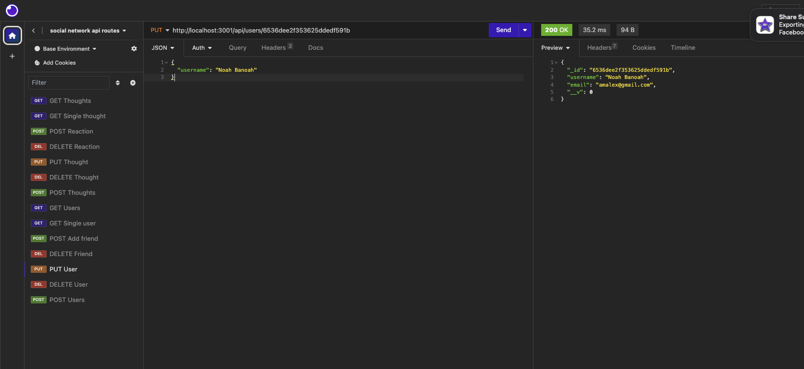

# Social Network API

## Table of Contents
- [Description](#description)
- [Installation](#installation)
- [Usage](#usage)
- [License](#license)
- [Contributing](#contributing)
- [Tests](#tests)
- [Questions](#questions)

## Description
This is an app that shows the inner workings of a social network website, with the ability to make comments on posts and add/delete friends.

## Installation
When the npm packages have been installed run "npm start" and the app will run on local host.

## Usage
Enter the routes you wish to explore on Insomnia, or preferred application.

## License
Distributed under the MIT License.

## Contributing
Steve Weede

## Tests

## Questions
Please send questions to:
steveweede@gmail.com or to BabyStu at Github